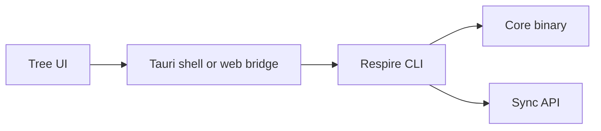

# Respire Client

Frontend and desktop shell for Respire. The client invokes a versioned CLI for memory operations; it does not compile or contain the Core implementation.



## Repository map

| Path | Responsibility |
| --- | --- |
| `client/tree-ui/` | React tree, diary, settings, and memory views |
| `client/src-tauri/` | Native commands, dialogs, and CLI subprocess bridge |
| `client/ui/` | Vanilla JavaScript interface |
| `web-dist/` | Static frontend layout consumed by `rsrs web` |
| `contracts/compatibility-matrix.json` | CLI version and desktop artifact mapping |
| `build/` | Model verification and sidecar staging |

## Development

Use Node.js 20.19+ or 22.12+ for the frontend. Native builds also need Rust and the platform dependencies required by Tauri 2.

```sh
cd client/tree-ui
npm ci
npm test
npm run build
```

The frontend build produces `dist/index.html`. See [tree-ui](client/tree-ui/README.md) for its component map.

## Desktop sidecar

Obtain a matching CLI binary and its `rsrs-<CLI-target>-runtime.tar.gz` companion from the same release. Extract them into one directory and name the executable `rsrs` or `rsrs.exe` before staging.

```sh
# Run from the repository root.
node client/src-tauri/binaries/sync-cli-bin.mjs <CLI-binary-directory> [desktop-target]
cd client/src-tauri
npx @tauri-apps/cli@2 build --config tauri.core-runtime.conf.json
```

The desktop installer copies the unique `rsrs` executable together with every DLL and license file declared in the bundled `core-runtime.json`. Missing manifests or runtime files fail installation explicitly. Staging validates runtime checksums and generates a Tauri resource configuration for native libraries and notices. The compatibility matrix maps Linux desktop targets to their musl CLI artifacts. The release workflow also verifies the bundled legacy BGE model and includes its license. Model files, CLI binaries, and generated runtime resources are not source files and must stay out of Git.

## Component boundaries

| Component | Client interaction |
| --- | --- |
| [CLI](https://github.com/risense-ai/respire-cli) | Versioned executable; existing JSON command contract |
| [Server](https://github.com/risense-ai/respire-server) | Synchronization through the CLI |
| Core | No direct source or Rust dependency; consumed by the CLI as a binary |
| [Documentation](https://github.com/risense-ai/respire-docs) | Canonical compatibility contracts and architecture |

The only CLI command is `rsrs`; install it with `npm i -g @rsrsai/cli` or `pnpm add -g @rsrsai/cli`. The desktop application ID is `ai.risense.respire`. Previous desktop application data directories are not migrated automatically. The default synchronization endpoint is `https://api.rsrs.rs`; configure the actual server address for a deployment.

New configuration and account data default to `~/.respire`; the client does not implicitly load previous application configuration. The CLI local runtime defaults to `127.0.0.1:15169`. Site: `https://rsrs.rs`; user dashboard: `https://dash.rsrs.rs`; administrator dashboard: `https://admin.rsrs.rs`; API: `https://api.rsrs.rs`. These are configuration values, not a deployment confirmation.

The existing `ONEMEMORY_*` environment names and command identifiers are compatibility interfaces. Chinese UI text and sample data are preserved.

## Validation and releases

The existing frontend tests cover typography preferences, body rendering, tree filtering, and access scopes. Native packaging requires its target platform and the matching CLI artifact. A local Windows check does not verify macOS or Linux installers.

Pushing `main` builds all five desktop targets and publishes a development prerelease in this repository after all targets pass. Its version is `<source-version>-dev.<run-id>`; version files are changed only inside the build. Pushing a stable `v<source-version>` tag publishes a stable release. Automatic builds consume one complete published CLI release, verify its source identities and hashes, and record the selected CLI version and commit. Development builds record CLI `main` at the start and wait up to 20 minutes for its complete published assets; they fail explicitly at the limit instead of consuming an older build.

The manual `Release` workflow still defaults to `publish=false`. Supply a successful `respire-cli` Release validation run ID and its exact 40-character source SHA. This mode builds native installers and retains checksummed Actions artifacts without creating a GitHub Release or deploying a service.

```sh
gh workflow run release.yml --repo risense-ai/respire-client \
  -f ref=main -f cli_run_id=<successful-run-id> -f cli_sha=<exact-cli-sha> \
  -f publish=false
```

Manual `publish=true` requires a version tag matching `tauri.conf.json` and publishes to this repository with its Actions token. Mirroring to `respire-releases` separately requires `RELEASES_GITHUB_TOKEN`; an unconfigured mirror reports that status and the working download URL explicitly. macOS signing/notarization and Windows signing are not configured; successful package construction does not establish those distribution guarantees. Bundled CLI runtime files are resolved through Tauri's platform resource directory when installing the CLI into the user PATH.

## License

First-party material uses the [Respire Noncommercial License 1.0](LICENSE).
Personal noncommercial use and self-hosting are permitted. Commercial use,
including internal business deployment, requires prior written authorization.
See [commercial licensing](COMMERCIAL-LICENSE.md).
