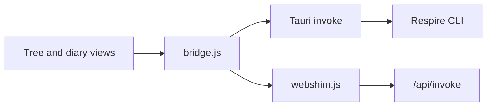

# Tree UI

React frontend shared by the Respire desktop client and `rsrs web`. Memory operations use the CLI through a native Tauri bridge or the web server's `/api/invoke` endpoint.



## Develop and verify

Use Node.js 20.19+ or 22.12+.

```sh
npm ci
npm run dev
npm test
npm run build
```

Vite prints the development URL and produces a single `dist/index.html` file. A standalone static preview does not replace an authenticated CLI runtime. Native dialogs and system-font enumeration require the desktop shell.

## Source map

| File | Responsibility |
| --- | --- |
| `src/TreeClient.jsx` | Layout, selection, editing, account settings, and maintenance views |
| `src/TreeSidebar.jsx` | Tree navigation, paging, keyboard input, and drag operations |
| `src/treeModel.js` | Parent relationships, stable paths, diary grouping, and visible nodes |
| `src/treeAccess.js` | Scope summaries and direct or inherited grants |
| `src/ScopeViews.jsx` | Synchronization and context-injection views |
| `src/DiaryCalendar.jsx` | Local-date calendar and diary selection |
| `src/readingText.js` | Display segmentation for bracketed memory-body labels |
| `src/appearance.js` | Persisted typography and scaling preferences |
| `src/bridge.js` | Explicit memory operations through the runtime bridge |
| `src/webshim.js` | Browser command forwarding and access-token headers |
| `src/MemoryGraph.jsx` | Auxiliary graph view |
| `tests/` | Existing typography, body-rendering, tree-filtering, and scope checks |

## Interaction

Tree navigation supports expanding nodes, viewing descendants, editing, and moving subtrees without creating cycles. Diary entries use local calendar dates. Appearance preferences apply immediately and persist in localStorage. Data operations and synchronization use the CLI; the frontend does not implement embedding, ranking, or account cryptography.

| Shortcut | Action |
| --- | --- |
| Command/Ctrl K | Search |
| Command/Ctrl N | Create a memory |
| Shift Command/Ctrl N | Create a subtree |
| Shift Command/Ctrl C | Copy the node link |
| Arrow keys and Enter | Navigate and select |
| F2 / Backspace | Edit / delete |
| Command/Ctrl Z | Undo an eligible operation |
| Escape | Close the current dialog |

Text inputs retain their normal editing behavior. Chinese interface text, protocol strings, and test fixtures remain unchanged. Bundled fonts retain their original licenses.
