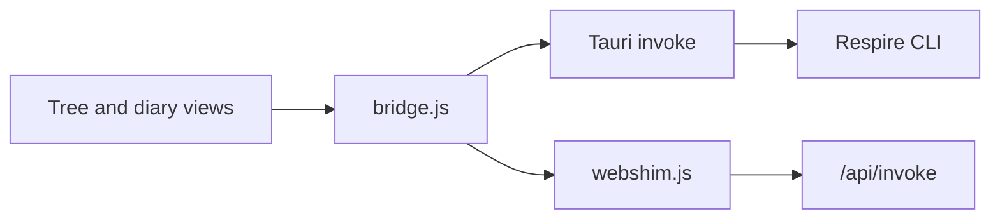

# Tree UI

React frontend shared by the Respire desktop client and `rsrs web`. Memory operations use the CLI through a native Tauri bridge or the web server's `/api/invoke` endpoint.



## Develop and verify

Use Node.js 20.19+ or 22.12+.

```sh
npm ci
npm run dev
npm test
npm run build
```

Vite prints the development URL and produces a single `dist/index.html` file. A standalone static preview does not replace an authenticated CLI runtime. Native dialogs and system-font enumeration require the desktop shell.

## Source map

| File | Responsibility |
| --- | --- |
| `src/TreeClient.jsx` | Layout, selection, editing, account settings, and maintenance views |
| `src/TreeSidebar.jsx` | Tree navigation, paging, keyboard input, and drag operations |
| `src/treeModel.js` | Parent relationships, stable paths, diary grouping, and visible nodes |
| `src/treeAccess.js` | Scope summaries and direct or inherited grants |
| `src/ScopeViews.jsx` | Synchronization and context-injection views |
| `src/DiaryCalendar.jsx` | Local-date calendar and diary selection |
| `src/readingText.js` | Display segmentation for bracketed memory-body labels |
| `src/appearance.js` | Persisted typography and scaling preferences |
| `src/bridge.js` | Explicit memory operations through the runtime bridge |
| `src/webshim.js` | Browser command forwarding and access-token headers |
| `src/MemoryGraph.jsx` | Auxiliary graph view |
| `tests/` | Existing typography, body-rendering, tree-filtering, and scope checks |

## Interaction

Tree navigation supports expanding nodes, viewing descendants, editing, and moving subtrees without creating cycles. Diary entries use local calendar dates. Appearance preferences apply immediately and persist in localStorage. Data operations and synchronization use the CLI; the frontend does not implement embedding, ranking, or account cryptography.

| Shortcut | Action |
| --- | --- |
| Command/Ctrl K | Search |
| Command/Ctrl N | Create a memory |
| Shift Command/Ctrl N | Create a subtree |
| Shift Command/Ctrl C | Copy the node link |
| Arrow keys and Enter | Navigate and select |
| F2 / Backspace | Edit / delete |
| Command/Ctrl Z | Undo an eligible operation |
| Escape | Close the current dialog |

Text inputs retain their normal editing behavior. Chinese interface text, protocol strings, and test fixtures remain unchanged. Bundled fonts retain their original licenses.

## Automatic refresh contract

The desktop polls `rsrs memory-revision` every five seconds while visible and idle.
The producer must return `ResultEnvelope.summary = {profile, revision}`, and `list`
must identify its own store in `ResultEnvelope.summary.profile`. The revision is
an opaque token; compare the entire profile/token pair. Neither counts, timestamps,
nor SQLite main-file/WAL modification times are a complete substitute.

The matching CLI producer is [respire-cli PR #14](https://github.com/risense-ai/respire-cli/pull/14),
built from base `a15da0069d4dedbbcb7283543584d89cc1e10e13`.
The command is capability-detected rather than inferred from `1.0.x` version numbers.
Ship a CLI release containing that producer before shipping this Client update.
Current published CLIs without the command retain initial/manual reads, show a
clear upgrade warning, and do not repeatedly load plaintext for change detection.
The native `db_stamp` implementation has been replaced; frontend and native shell
must be built together.

A changed token triggers a status/list read, followed by a second token check.
The status and list must identify the same profile as both token reads, including
A→B→A switches during a request. Failed or stale reads keep existing data and do
not advance the applied baseline. Active editors/dialogs pause automatic reads;
late completions cannot overwrite an in-progress edit. Same-profile refreshes
keep selection and expansion; profile changes reset the view. Failures use bounded
backoff, and manual refresh bypasses it.

Memory/status/edit/sync response normalization accepts legacy bare results and
current CLI envelopes only for the named operations in `runtimeResult.js`. This
is not a complete account/configuration/authentication contract migration.

### Regression checks

```sh
npm test
npm run build
npx playwright install chromium
npm run test:browser
# From repository root, without the native platform SDK:
rustc --edition=2021 --test client/src-tauri/src/memory_args.rs -o /tmp/respire-memory-args-tests
/tmp/respire-memory-args-tests
```

Browser tests use only a synthetic intercepted CLI. They cover React StrictMode
startup, legacy/manual fallback, cheap unchanged polls, external updates/deletion,
editing importance in both directions, and a dialog opening during a pending read.
They do not validate a Tauri webview or installed desktop CLI. Full native checking
still requires Rust plus the Tauri platform SDK; packaging and release validation
remain separate.
